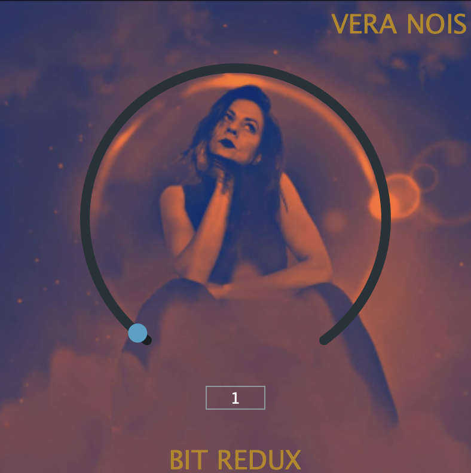

# Bit-redux
A simple Bit crusher plug-in, implemented in C++ using the JUCE framework

&nbsp;

It works in any DAW which accepts VST, VST3 or AU.

## Installation:

1. JUCE: You can download JUCE from official website https://juce.com/

2. Xcode (MacOs): Just download from App Store https://apps.apple.com/us/app/xcode/id497799835?mt=12

3. Visual Studio (Windows): You can download it from official website https://visualstudio.microsoft.com/es/

4. Compile

5. Copy .vst, .vst3 or .component from Builds folder to your plug-ins folder.

Enjoy!